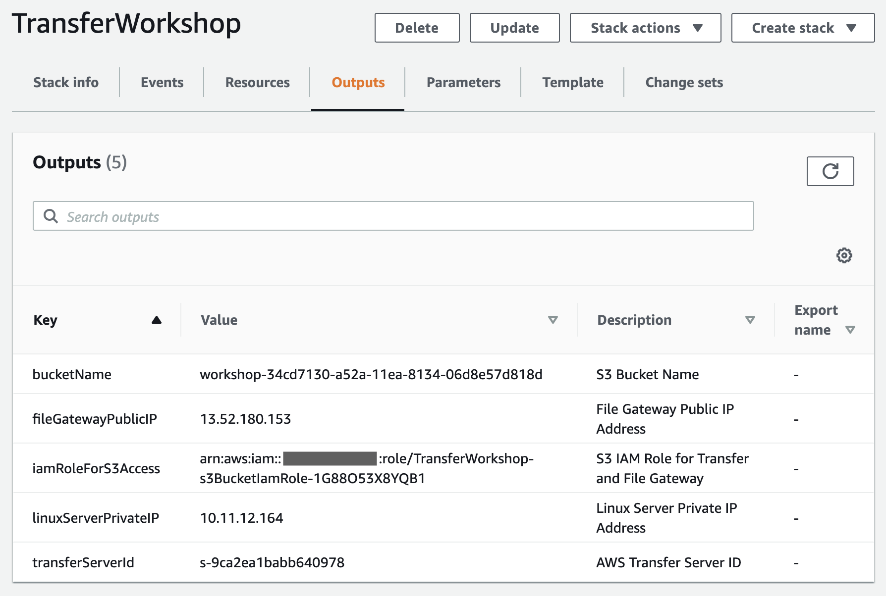

# Access data in Amazon S3 using AWS Transfer Family and AWS Storage Gateway

© 2020 Amazon Web Services, Inc. and its affiliates. All rights reserved.
This sample code is made available under the MIT-0 license. See the LICENSE file.

Errors or corrections? Contact [jeffbart@amazon.com](mailto:jeffbart@amazon.com).

---

# Module 1
## Deploy resources

In this module, you will use CloudFormation to deploy all AWS resources necessary to complete this workshop, as shown in the diagram below.  The resources include an AWS Transfer server, an EC2 instance running Storage Gateway in File mode (i.e. File Gateway), and a Linux server running on EC2.  An S3 bucket will also be created in the region you select.  IAM roles will be automatically created to secure access to the S3 bucket.

## Module Steps

#### 1. Deploy AWS resources

1. Click one of the launch links in the table below to deploy workshop resources using CloudFormation.  To avoid errors during deployment, select a region in which you have previously created AWS resources.

  | **Region Code** | **Region Name** | **Launch** |
  | --- | --- | --- |
  | us-west-1 | US West (N. California) | [Launch in us-west-1](https://console.aws.amazon.com/cloudformation/home?region=us-west-1#/stacks/new?stackName=TransferWorkshop&amp;templateURL=https://aws-transfer-samples.s3-us-west-2.amazonaws.com/workshops/transfer-storage-gateway/transfer-storage-gateway-workshop.yaml) |
  | us-west-2 | US West (Oregon) | [Launch in us-west-2](https://console.aws.amazon.com/cloudformation/home?region=us-west-2#/stacks/new?stackName=TransferWorkshop&amp;templateURL=https://aws-transfer-samples.s3-us-west-2.amazonaws.com/workshops/transfer-storage-gateway/transfer-storage-gateway-workshop.yaml) |
  | us-east-1 | US East (N. Virginia) | [Launch in us-east-1](https://console.aws.amazon.com/cloudformation/home?region=us-east-1#/stacks/new?stackName=TransferWorkshop&amp;templateURL=https://aws-transfer-samples.s3-us-west-2.amazonaws.com/workshops/transfer-storage-gateway/transfer-storage-gateway-workshop.yaml) |
  | us-east-2 | US East (Ohio) | [Launch in us-east-2](https://console.aws.amazon.com/cloudformation/home?region=us-east-2#/stacks/new?stackName=TransferWorkshop&amp;templateURL=https://aws-transfer-samples.s3-us-west-2.amazonaws.com/workshops/transfer-storage-gateway/transfer-storage-gateway-workshop.yaml) |
  | eu-west-1 | Ireland | [Launch in eu-west-1](https://console.aws.amazon.com/cloudformation/home?region=eu-west-1#/stacks/new?stackName=TransferWorkshop&amp;templateURL=https://aws-transfer-samples.s3-us-west-2.amazonaws.com/workshops/transfer-storage-gateway/transfer-storage-gateway-workshop.yaml) |
  | eu-central-1 | Frankfurt | [Launch in eu-central-1](https://console.aws.amazon.com/cloudformation/home?region=eu-central-1#/stacks/new?stackName=TransferWorkshop&amp;templateURL=https://aws-transfer-samples.s3-us-west-2.amazonaws.com/workshops/transfer-storage-gateway/transfer-storage-gateway-workshop.yaml) |

2. Click **Next** on the Create Stack page.
3. Keep the Stack Name as-is. Under the **Parameters** section, enter a CIDR block to use for the VPC that will be created, or leave the default as-is. Do not edit the values of the AMI IDs.  When you are done, click **Next**.
4. Click **Next** again. (skipping the Options and Advanced options sections)
5. On the Review page, scroll to the bottom and check the box to acknowledge that CloudFormation will create IAM resources, then click  **Create stack**.

Wait for the CloudFormation stack to reach the CREATE\_COMPLETE state before proceeding to the next steps.  It will take about **3 minutes** for the CloudFormation stack to complete.

**NOTE:** If the stack fails to deploy because an EC2 instance type is not available in a particular availability zone, delete the stack and retry in the same region or in a different region.

#### 3. Stack Outputs

Upon completion, the CloudFormation stack will have a list of &quot;Outputs&quot;.  These are values such as IP addresses and resource names that will be used throughout the workshop.  You can either copy these values elsewhere or keep the page open in your browser and refer to them as you go through the workshop.

On the CloudFormation page , click on the **Outputs** tab, as shown in the image below.  You should see the following values listed:

- **bucketName** – This is the name of the S3 bucket that was automatically created.  You will use this when you create an NFS share on the File Gateway.
- **fileGatewayPublicIP** – This is the public IP address of the EC2 instance running the Storage Gateway appliance.  You will use this when you activate the gateway.
- **iamRoleForS3Access** - This is an IAM role that provides access to the S3 bucket.  This role will be used both by File Gateway and by AWS Transfer.
- **linuxServerPrivateIP** – This is the private IP address of the Linux server.  You will use this when you create the File Gateway share and when you configure the security group for the AWS Transfer VPC endpoint.  
- **transferServerId** – This is the ID of the AWS Transfer server that was created.  

  

## Validation Step

Open a new tab in your browser and navigate to the AWS management console for EC2.  You should see two new instances created: one called "Workshop-FileGateway" and one call "Workshop-LinuxServer".

If you do not see these resources, verify that the CloudFormation stack completed with state "CREATE_COMPLETE".

## Module Summary

In this module, you deployed all resources necessary to complete this workshop and verified that resources were deployed correctly.

In the next module, you will activate the File Gateway, create an NFS share to provide file access to the S3 bucket, and then write a file to the share from the Linux server.

Go to [Module 2](/module2).
