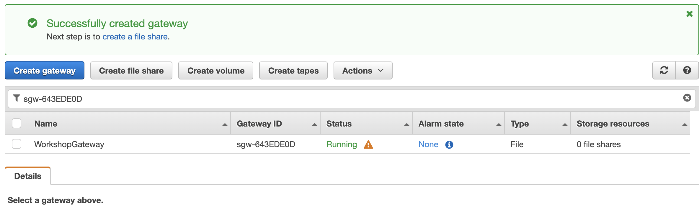
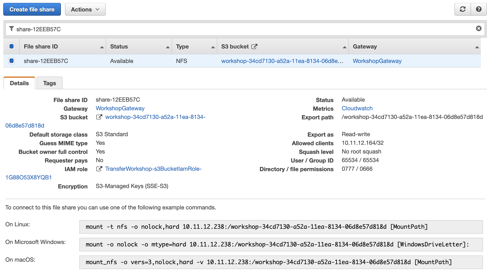
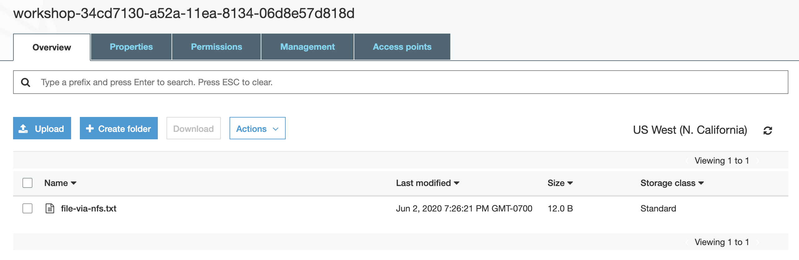

# Access data in Amazon S3 using AWS Transfer Family and AWS Storage Gateway

© 2020 Amazon Web Services, Inc. and its affiliates. All rights reserved.
This sample code is made available under the MIT-0 license. See the LICENSE file.

Errors or corrections? Contact [jeffbart@amazon.com](mailto:jeffbart@amazon.com).

---

# Module 2
## Configure the File Gateway

In the previous module, you deployed various AWS resources using CloudFormation.  This included an EC2 instance running File Gateway and another EC2 instance running a Linux server.  In this module, you will activate the File Gateway and then create an NFS share, backed by the S3 bucket created in CloudFormation.  You will then mount the NFS share on the Linux server and write a file to it, showing how you can use File Gateway to access data in S3 using standard file protocols.

## Module Steps

#### 1. Activate the File Gateway

Follow the steps below to activate the gateway.

1. Go to the AWS Management console page, click **Services** then select **Storage Gateway.**
2. If no gateways exist, click the **Get started** button, otherwise click the **Create gateway** button.
3. Select the **File gateway** type and click **Next.**
4. Select **Amazon EC2** as the host platform, then click **Next**.
5. Select the **Public** endpoint type, then click **Next**.
6. Enter the **Public IP address** of the File Gateway instance that was created in the first module using CloudFormation. The IP address is available in the outputs of the CloudFormation stack. Click **Connect to gateway**.
7. Name the gateway &quot;WorkshopGateway&quot; then click **Activate gateway**.
8. The gateway will be activated and then it will spend a minute or so preparing the local disk devices.  Allocate the **300 GiB /dev/sdc** device to **Cache.**  This is the local disk on the gateway that will be used to cache frequently accessed files.
9. Click **Configure logging.**
10. Configure the setting to _Disable logging_ then click **Save and continue.**
11. From the main Storage Gateway page, you will see your gateway listed.

    

#### 2. Create an NFS share

1. Click on the **Create file share** button
2. For the **Amazon S3 bucket name** , enter the name of the S3 bucket created by CloudFormation.  You can find the bucket name in the outputs of the CloudFormation stack.  The name begins with "workshop-" followed by a GUID.
3. Select **NFS** as the access method and make sure your gateway from the previous step is selected.
4. Click **Next**.
5. For the **Storage class**, select **S3 Standard**.  
6. Under **Access to your S3 bucket**, select **Use an existing IAM role** and then enter the ARN of the role from the outputs in the CloudFormation stack.
7. Click **Next**.
6. Under the **Allowed clients** section, click **Edit** and change &quot;0.0.0.0/0&quot; to the **Private IP Address** of the Linux server, followed by "/32".  This will allow only the Linux server to access the NFS file share on the gateway.  You can find the private IP address in the outputs of the CloudFormation stack.  Click the **Close** button.
7. Under the **Mount options** section, change the **Squash level** to &quot;No root squash&quot;.  Click the **Close** button.
8. Click **Create file share**.
9. Select the check box next to the new file share and note the mount instructions.

    

#### 3. Connect to the Linux server using Session Manager

1. From the AWS console, click  **Services**  and select  **EC2.**
2. Select  **Instances**  from the menu on the left.
4. Right-click on the **Workshop-LinuxServer** instance and select  **Connect** from the menu.
5. From the dialog box, select the **Session Manager** option.
6. Click **Connect**.  A new tab will be opened in your browser with a command line interface (CLI) to the Linux server. Keep this tab open - you will use the command line on the Linux server throughout this workshop.

#### 4. Mount the NFS share on the Linux server

1. From CLI on the Linux server, run the following command to create a new mount point for the File Gateway NFS share:

        $ sudo mkdir /mnt/nfs

2. Copy the Linux mount command from the Storage Gateway file share page and replace &quot;[MountPath]&quot; with &quot;/mnt/nfs&quot;.   **You must run the command as sudo.**
3. You now have an NFS mount point on your Linux server that connects you to the File Gateway.

## Validation Step

To verify that the File Gateway is working correctly, create a simple file using the following command on the Linux server:

        $ echo "Hello World" > /mnt/nfs/file-via-nfs.txt

Return to the AWS console, click  **Services**  and select **S3**.  Click on the bucket that was created via CloudFormation in the previous module.  Inside the bucket you should see a single object with a name that matches the file you just created on the Linux server.

When a file is written to File Gateway it is cached locally on the gateway and then persisted as an object in the S3 bucket that was configured for the gateway share.  The object stores both file data and metadata.  Click on the file and then click the **Open** button.  You should see "Hello World" displayed in your browswer.

## Module Summary

In this module, you activated the File Gateway, created an NFS share on the gateway, mounted the share on the Linux server, and then wrote a file to the NFS share.  You verified that the file was written successfully to the S3 bucket.  With the file in the S3 bucket, it can now be accessed by many other AWS services that integrate with Amazon S3, including AWS Transfer Family. 

In the next module, you will configure your AWS Transfer server to allow access to the S3 bucket using common file transfer protocols such as SFTP.

Go to [Module 3](/module3).
