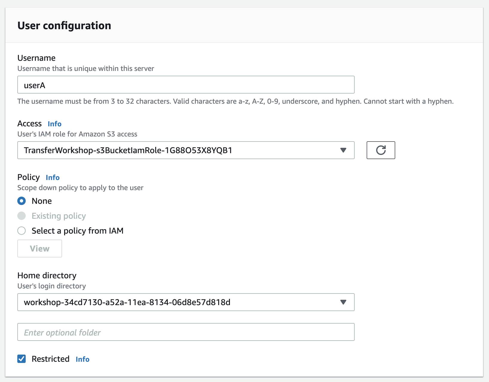
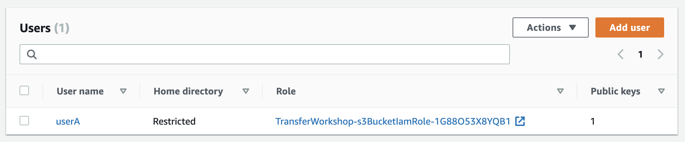
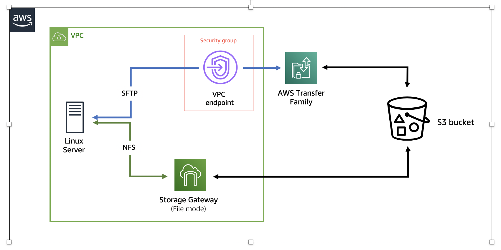
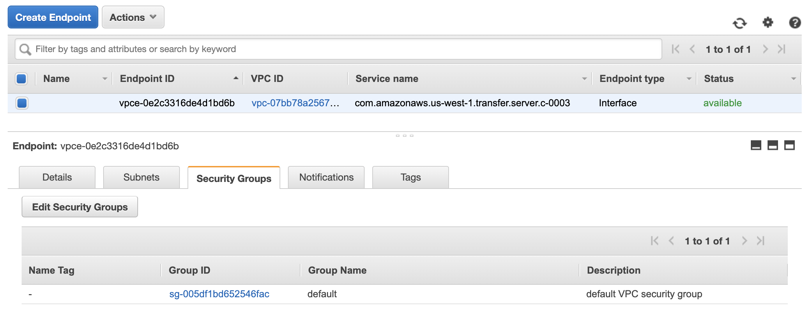
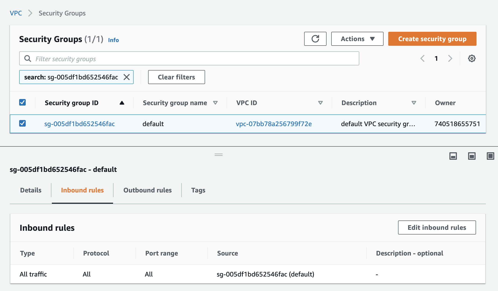
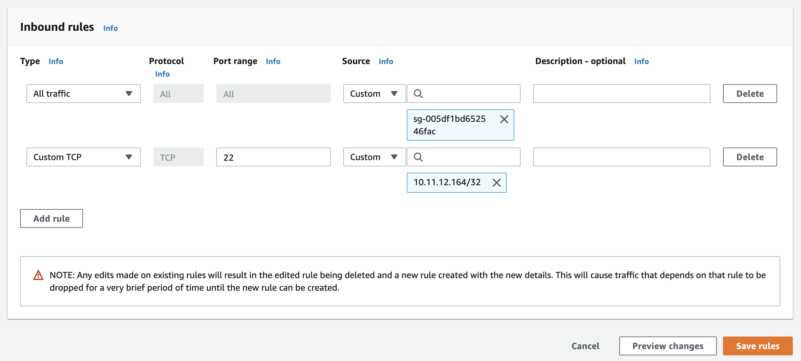
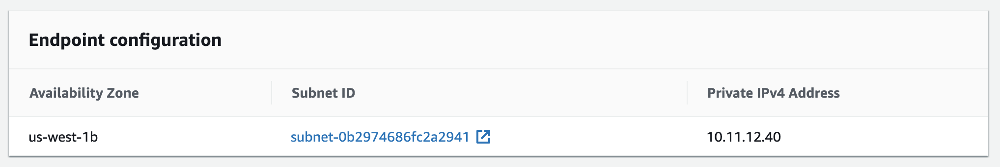

# Access data in Amazon S3 using AWS Transfer Family and AWS Storage Gateway

© 2020 Amazon Web Services, Inc. and its affiliates. All rights reserved.
This sample code is made available under the MIT-0 license. See the LICENSE file.

Errors or corrections? Contact [jeffbart@amazon.com](mailto:jeffbart@amazon.com).

---

# Module 3
## Configure the AWS Transfer server

In the previous module, you activated the File Gateway and created an NFS share to provide access to the S3 bucket.  You saw how writing a file to the NFS share automatically created an object in S3.  In this module, you will configure the AWS Transfer server to also provide access to the S3 bucket, but using the SFTP file transfer protocol instead.  You will start by creating a user on the AWS Transfer server.  You will then configure the Security Group on the VPC endpoint used by AWS Transfer to allow access from the Linux server.  Finally, you will transfer a test file and see that it was placed correctly in S3. 

## Module Steps

#### 1. Create an SSH key on the Linux server

AWS Transfer is designed to provide access to S3 using common file transfer protocols.  Users or applications that want to access the Transfer server must be able to authenticate.  AWS Transfer Family provides two methods of authentication: service-managed or a [custom identity provider](https://docs.aws.amazon.com/transfer/latest/userguide/authenticating-users.html).  In this workshop, you'll use the service-managed identity provider, which authenticates users via SSH keys.

Before you can create a user in AWS Transfer, you will first need to create an SSH key pair on the Linux server.  Run the following command on the Linux server to generate an SSH key pair:

        $ ssh-keygen

Press Enter several times to accept the default settings, then run the following command to display the public key:

        $ cat /home/ssm-user/.ssh/id_rsa.pub
  
#### 2. Create a user on the AWS Transfer server

1. Go to the AWS Management console page, click **Services** then select **AWS Transfer Family.**
2. Click on the Server ID that matches the one in the CloudFormation outputs.
3. Scroll down to the **Users** section and click on the **Add user** button.
4. For the username, enter **userA**.
5. Under the **Access** drop-down, select the same IAM role that you used when creating the File Gateway NFS share.  You can search for the string "s3BucketIamRole".
6. Keep **Policy** set to None.
7. For **Home directory**, select the S3 bucket that was created by CloudFormation.  It begins with **"workshop-"**.
8. Check the **Restricted** check box.  This will limit the user to view only the contents of the S3 bucket.

    

9. Copy the entire SSH key string from the previous step and paste it into the box under **SSH public key**.
10. Click **Add**.

You should now have a user listed in the **Users** section, as shown below:

#### 3. Configure the Security Group for the VPC endpoint

Before you can connect to the AWS Transfer server from the Linux server, you will need to whitelist the Linux server IP address in the Security Group configured on the VPC endpoint generated by the AWS Transfer server.  This is shown in the architecture diagram below:

1. Go to the AWS Management console page, click **Services** then select **VPC.**
2. On the left side of the page, click on **Endpoints**.
3. Check the box next to the endpoint where the **Service name** contains "transfer.server".
4. Click on the **Security Groups** tab to view the security groups assigned to the VPC endpoint.  There should be only one security group in the list, which is the default security group for the VPC.

    

5. Click on the security group ID to view the rules for the security group.
6. In the new page that opens, click on the **Inbound rules** tab.

    

7. Click on the **Edit inbound rules** button.
8. Click on **Add rule**.
9. Under **Port range** on the new rule, enter "22", which is the default port used by the SFTP protocol.
10. Under the **Source**, select "Custom" and then in the adjacent box, enter the **Private IP address** of the Linux server, followed by "/32".  You can get the private IP address from the CloudFormation outputs.
11. Scroll down and click the **Save rules** button.

    

In AWS, security groups act like firewalls, controlling inbound and outbound traffic to AWS resources.  In editing the security group, you have added a new rule allowing inbound traffic from the Linux server to reach the VPC endpoint, which will then automatically route traffic to the AWS Transfer server.

#### 4. Connect using SFTP

WIth the user added and the security group configured, you can now access the S3 bucket via SFTP from your Linux server.  You will connect to the AWS Transfer server using a Private IP address allocated when the Transfer server was created.  Go to the AWS Transfer page for your server and go to the **Endpoint configuration** section.  Copy the **Private IPv4 Address**.

Return to the CLI and enter the following commands to change to your home directory and then connect to the AWS Transfer server via SFTP.  Replace the IP address with the one you just copied.

    $ cd ~
    $ sftp userA@10.11.12.40

If you are prompted to continue connecting, enter "yes" then hit Enter.  Once you are connected, you will be presented with a new prompt.  Enter the following command:

    sftp> ls

You should see the file named "file-via-nfs.txt" that was created in the previous module, when you wrote the file via File Gateway.  Run the following command to copy the file to the Linux server and then quit out of sftp:

    sftp> get file-via-nfs.txt
    sftp> quit

## Validation Step

The **get** command you ran previously made a local copy of the file on the Linux server, in your home directory.  Run the following command to see the contents of the file:

    $ cat file-via-nfs.txt

You should see "Hello World" printed.

## Module Summary

In this module, you created a user in AWS Transfer, configured the VPC endpoint security group to allow access from the Linux server, and then connected to the AWS Transfer server using SFTP.  Once connected, you saw that the file created in S3 via File Gateway in the previous module, was also visible via SFTP.

In the next module, you will learn how to coordinate data workflows between AWS Transfer Family and Storage Gateway by writing a file via SFTP and using the RefreshCache API on File Gateway.

Go to [Module 4](/module4).
