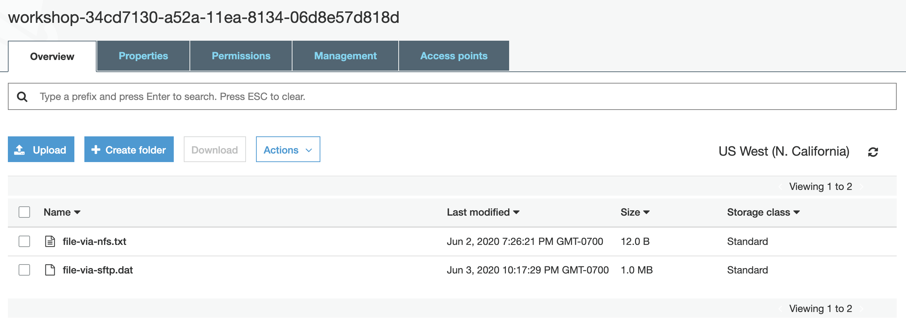
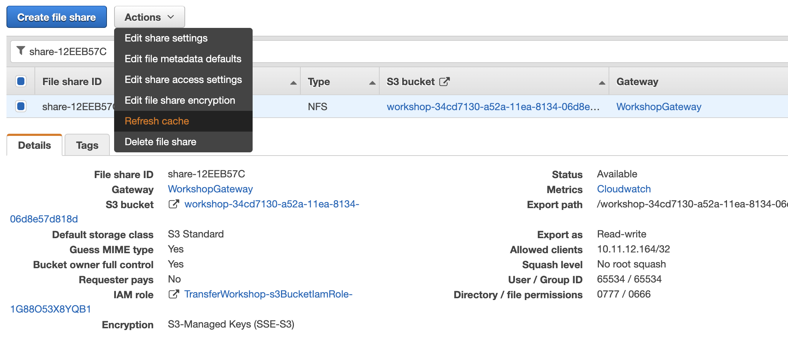

# Access data in Amazon S3 using AWS Transfer Family and AWS Storage Gateway

© 2020 Amazon Web Services, Inc. and its affiliates. All rights reserved.
This sample code is made available under the MIT-0 license. See the LICENSE file.

Errors or corrections? Contact [jeffbart@amazon.com](mailto:jeffbart@amazon.com).

---

# Module 4
## Using RefreshCache to see changes to S3 in File Gateway

In the previous module, you configured AWS Transfer to allow access via SFTP from the Linux server.  You then connected to the AWS Transfer server and copied the file that was in the S3 bucket, which had previously been written there via File Gateway. You now have everything in place to write files via File Gateway and read them via SFTP through AWS Transfer.  In this module, you will write files via SFTP and read them via File Gateway, using the RefreshCache API to update the metadata cache on the gateway.

## Module Steps

#### 1. Write to S3 via SFTP

Return to the CLI and enter the following commands to generate a file on the Linux server and get an MD5 checksum of the new file:

    $ cd ~
    $ dd if=/dev/urandom of=file-via-sftp.dat bs=1M count=1
    $ md5sum file-via-sftp.dat

Note the MD5 checksum and then log back into the AWS Transfer using the following command, replacing the IP address below with the IP address of your AWS Transfer server used in the previous module:

    $ sftp userA@10.11.12.40

Run the following command to copy the file to S3 via SFTP over the Transfer server and then quit the SFTP session:

    sftp> put file-via-sftp.dat
    sftp> quit

Return to the AWS console, click  **Services**  and select **S3**.  Click on the bucket that was created via CloudFormation in the first module.  Inside the bucket you should now see two objects: the first one created via File Gateway and the second one that was just uploaded.

#### 2. Read the new file using File Gateway

Return to the CLI and enter the following commands to list the contents of the top level folder on the File Gateway:

    $ ls /mnt/nfs

You should see only the original file.  Where is the new file you just wrote via SFTP?

In this case, the file was written to the S3 bucket via AWS Transfer, instead of through the File Gateway share.  File Gateway is not aware that there are new objects in the bucket.  In order to see the new file on the Linux server, you need to refresh the metadata cache on the File Gateway.

Return to the AWS management console and go to the **Storage Gateway** service.  On the left side of the page, click on **File shares** and select the NFS share that you created earlier from the list.  Click on the **Actions** button and select **Refresh cache** then click **Start**.

Return to the CLI and list the folder again using the following command:

    $ ls /mnt/nfs

This time you should now see both files that are in the S3 bucket.  Run the following command to get the MD5 checksum of the file via File Gateway:

    $ md5sum /mnt/nfs/file-via-sftp.dat

The checksum should match the same one that you generated earlier, indicating that the file was successfully copied via SFTP to S3, and then accessed properly via File Gateway.

## Module Summary

In this module, you wrote a file to S3 via SFTP and then learned how to use the RefreshCache API to make the file visible on the File Gateway.  You've now shown that you can write to and read files from an S3 bucket using both AWS Transfer and File Gateway.  You are now enabled to create workflows that need to use both file transfer and file storage protocols in tandem.

In the next module, you will clean up the resources you created in this workshop.

Go to [Module 5](/module5).
